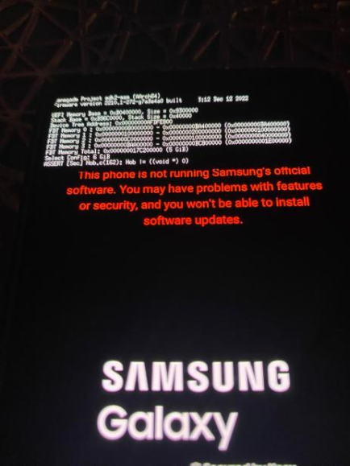

# EDK2 UEFI firmware for Qualcomm Snapdragon platforms

## Problems

Doesn't boot, shows this error:




Probably memory map is incorrect, location of the file that possibly needs modifying:
```
Silicon/Qualcomm/sm7325/Library/PlatformMemoryMapLib/PlatformMemoryMapLib.c
```

Older EDK2 UEFI repo that boots UEFI shell on a52sxq, but nothing works:
[edk2-SMA528B](https://github.com/arminask/edk2-SMA528B)


Useful information extracted from a52sxq:

```
# xxd /sys/firmware/devicetree/base/memory/reg
00000000: 0000 0000 8000 0000 0000 0000 3a40 0000  ............:@..
00000010: 0000 0001 0000 0000 0000 0001 0000 0000  ................
00000020: 0000 0000 c000 0000 0000 0000 4000 0000  ............@...
00000030: 0000 0000 baa0 0000 0000 0000 01e0 0000  ................
```

```
# cat /proc/iomem
00100000-002effff : 100000.clock-controller cc_base
00408000-00408fff : 408000.qcom,ipcc qcom,ipcc@408000
00780000-00786fff : 780000.qfprom qfprom@780000
00980000-00983fff : 980000.i2c i2c@980000
00984000-00987fff : 984000.i2c i2c@984000
0098c000-0098ffff : 98c000.i2c i2c@98c000
00990000-00993fff : 990000.i2c i2c@990000
009c0000-009c1fff : 9c0000.qcom,qupv3_0_geni_se qcom,qupv3_0_geni_se@9c0000
00a80000-00a83fff : a80000.i2c i2c@a80000
00a84000-00a87fff : a84000.i2c i2c@a84000
00a94000-00a97fff : a94000.i2c i2c@a94000
00ac0000-00ac1fff : ac0000.qcom,qupv3_1_geni_se qcom,qupv3_1_geni_se@ac0000
01500000-01500fff : 1500000.interconnect interconnect@1500000
01502000-01502fff : 1502000.interconnect interconnect@1502000
01580000-01580003 : 1580000.interconnect interconnect@1580000
01680000-0169547f : 1680000.interconnect interconnect@1680000
016e0000-016fc07f : 16e0000.interconnect interconnect@16e0000
01700000-0172b07f : 1700000.interconnect interconnect@1700000
01740000-0175e07f : 1740000.interconnect interconnect@1740000
01d84000-01d86fff : 1d84000.ufshc ufs_mem
01d87000-01d87dff : 1d87000.ufsphy_mem phy_mem
01d88000-01d8ffff : 1d84000.ufshc ufs_ice
01d90000-01d98fff : 1d84000.ufshc ufs_ice_hwkm
03c40000-03c4f07f : 3c40000.interconnect interconnect@3c40000
03d00000-03d3ffff : kgsl-3d0
03d90000-03d98fff : 3d90000.clock-controller cc_base
03da0000-03dbffff : 3da0000.kgsl-smmu base
03dd6000-03dd601f : 3da0000.kgsl-smmu tcu-base
03dd6200-03dd6207 : 3dd9000.gfx_0_tbu status-reg
03dd6208-03dd620f : 3ddd000.gfx_1_tbu status-reg
03dd9000-03dd9fff : 3dd9000.gfx_0_tbu base
03ddd000-03dddfff : 3ddd000.gfx_1_tbu base
06002000-06002fff : stm-base
  06002000-06002fff : 6002000.stm stm-base
06004000-06004fff : tpda-base
  06004000-06004fff : 6004000.tpda tpda-base
06005000-06005fff : funnel-base
  06005000-06005fff : 6005000.funnel funnel-base
0600f000-0600ffff : tpdm-base
  0600f000-0600ffff : 600f000.tpdm tpdm-base
06010000-06010fff : cti-base
  06010000-06010fff : 6010000.cti cti-base
06011000-06011fff : cti-base
  06011000-06011fff : 6011000.cti cti-base
06012000-06012fff : cti-base
  06012000-06012fff : 6012000.cti cti-base
06013000-06013fff : cti-base
  06013000-06013fff : 6013000.cti cti-base
06014000-06014fff : cti-base
  06014000-06014fff : 6014000.cti cti-base
06015000-06015fff : cti-base
  06015000-06015fff : 6015000.cti cti-base
06016000-06016fff : cti-base
  06016000-06016fff : 6016000.cti cti-base
06017000-06017fff : cti-base
  06017000-06017fff : 6017000.cti cti-base
06018000-06018fff : cti-base
  06018000-06018fff : 6018000.cti cti-base
06019000-06019fff : cti-base
  06019000-06019fff : 6019000.cti cti-base
0601a000-0601afff : cti-base
  0601a000-0601afff : 601a000.cti cti-base
0601b000-0601bfff : cti-base
  0601b000-0601bfff : 601b000.cti cti-base
0601c000-0601cfff : cti-base
  0601c000-0601cfff : 601c000.cti cti-base
0601d000-0601dfff : cti-base
  0601d000-0601dfff : 601d000.cti cti-base
0601e000-0601efff : cti-base
  0601e000-0601efff : 601e000.cti cti-base
0601f000-0601ffff : cti-base
  0601f000-0601ffff : 601f000.cti cti-base
06041000-06041fff : funnel-base
  06041000-06041fff : 6041000.funnel funnel-base
06042000-06042fff : funnel-base
  06042000-06042fff : 6042000.funnel funnel-base
06045000-06045fff : funnel-base
  06045000-06045fff : 6045000.funnel funnel-base
06046000-06046fff : replicator-base
  06046000-06046fff : 6046000.replicator replicator-base
06048000-06048fff : tmc-base
  06048000-06048fff : 6048000.tmc tmc-base
06800000-06800fff : tpdm-base
  06800000-06800fff : 6800000.tpdm tpdm-base
06803000-06803fff : tpda-base
  06803000-06803fff : 6803000.tpda tpda-base
06804000-06804fff : funnel-base
  06804000-06804fff : 6804000.funnel funnel-base
0680c000-0680cfff : funnel-base
  0680c000-0680cfff : 680c000.funnel funnel-base
0680d000-0680dfff : funnel-base-dummy
0682c000-0682cfff : tpdm-base
  0682c000-0682cfff : 682c000.tpdm tpdm-base
06841000-06841fff : tpdm-base
  06841000-06841fff : 6841000.tpdm tpdm-base
06844000-06844fff : tpdm-base
  06844000-06844fff : 6844000.tpdm tpdm-base
06845000-06845fff : cti-base
  06845000-06845fff : 6845000.cti cti-base
06846000-06846fff : funnel-base
  06846000-06846fff : 6846000.funnel funnel-base
06850000-06850fff : tpdm-base
  06850000-06850fff : 6850000.tpdm tpdm-base
06870000-06870fff : tpdm-base
  06870000-06870fff : 6870000.tpdm tpdm-base
06980000-06980fff : tpdm-base
  06980000-06980fff : 6980000.tpdm tpdm-base
06982000-06982fff : cti-base
  06982000-06982fff : 6982000.cti cti-base
06985000-06985fff : funnel-base
  06985000-06985fff : 6985000.funnel funnel-base
06986000-06986fff : funnel-base-dummy
0698b000-0698bfff : cti-base
  0698b000-0698bfff : 698b000.cti cti-base
069d0000-069d0fff : tpdm-base
  069d0000-069d0fff : 69d0000.tpdm tpdm-base
06ac0000-06ac0fff : tpdm-base
  06ac0000-06ac0fff : 6ac0000.tpdm tpdm-base
06ac1000-06ac1fff : tpdm-base
  06ac1000-06ac1fff : 6ac1000.tpdm tpdm-base
06ac2000-06ac2fff : funnel-base
  06ac2000-06ac2fff : 6ac2000.funnel funnel-base
06b00000-06b00fff : cti-base
  06b00000-06b00fff : 6b00000.cti cti-base
06b01000-06b01fff : cti-base
  06b01000-06b01fff : 6b01000.cti cti-base
06b03000-06b03fff : cti-base
  06b03000-06b03fff : 6b03000.cti cti-base
06b04000-06b04fff : funnel-base
  06b04000-06b04fff : 6b04000.funnel funnel-base
06b05000-06b05fff : tmc-base
  06b05000-06b05fff : 6b05000.tmc tmc-base
06b06000-06b06fff : replicator-base
  06b06000-06b06fff : 6b06000.replicator replicator-base
06b08000-06b08fff : tpda-base
  06b08000-06b08fff : 6b08000.tpda tpda-base
06b09000-06b09fff : tpdm-base
  06b09000-06b09fff : 6b09000.tpdm tpdm-base
06b0a000-06b0afff : tpdm-base
  06b0a000-06b0afff : 6b0a000.tpdm tpdm-base
06b0b000-06b0bfff : tpdm-base
  06b0b000-06b0bfff : 6b0b000.tpdm tpdm-base
06b0c000-06b0cfff : tpdm-base
  06b0c000-06b0cfff : 6b0c000.tpdm tpdm-base
06b0d000-06b0dfff : tpdm-base
  06b0d000-06b0dfff : 6b0d000.tpdm tpdm-base
06b0e000-06b0efff : tgu-base
  06b0e000-06b0efff : 6b0e000.tgu tgu-base
06c08000-06c08fff : tpdm-base
  06c08000-06c08fff : 6c08000.tpdm tpdm-base
06c28000-06c28fff : tpdm-base
  06c28000-06c28fff : 6c28000.tpdm tpdm-base
06c2e000-06c2efff : funnel-base
  06c2e000-06c2efff : 6c2e000.funnel funnel-base
06c30000-06c30fff : tpdm-base
  06c30000-06c30fff : 6c30000.tpdm tpdm-base
06c31000-06c31fff : tpdm-base
  06c31000-06c31fff : 6c31000.tpdm tpdm-base
06c37000-06c37fff : tpda-base
  06c37000-06c37fff : 6c37000.tpda tpda-base
06c38000-06c38fff : funnel-base
  06c38000-06c38fff : 6c38000.funnel funnel-base
06c60000-06c60fff : tpdm-base
  06c60000-06c60fff : 6c60000.tpdm tpdm-base
06c61000-06c61fff : cti-base
  06c61000-06c61fff : 6c61000.cti cti-base
06c70000-06c70fff : tpdm-base
  06c70000-06c70fff : 6c70000.tpdm tpdm-base
06c73000-06c73fff : funnel-base
  06c73000-06c73fff : 6c73000.funnel funnel-base
06e02000-06e02fff : cti-base
  06e02000-06e02fff : 6e02000.cti cti-base
06e05000-06e05fff : funnel-base
  06e05000-06e05fff : 6e05000.funnel funnel-base
06e0c000-06e0cfff : cti-base
  06e0c000-06e0cfff : 6e0c000.cti cti-base
06e0d000-06e0dfff : cti-base
  06e0d000-06e0dfff : 6e0d000.cti cti-base
06e0e000-06e0efff : cti-base
  06e0e000-06e0efff : 6e0e000.cti cti-base
06e10000-06e10fff : tpdm-base
  06e10000-06e10fff : 6e10000.tpdm tpdm-base
06e11000-06e11fff : cti-base
  06e11000-06e11fff : 6e11000.cti cti-base
06e12000-06e12fff : funnel-base
  06e12000-06e12fff : 6e12000.funnel funnel-base
07020000-07020fff : cti-base
  07020000-07020fff : 7020000.cti cti-base
07040000-07040fff : etm@7040000
07120000-07120fff : cti-base
  07120000-07120fff : 7120000.cti cti-base
07140000-07140fff : etm@7140000
07220000-07220fff : cti-base
  07220000-07220fff : 7220000.cti cti-base
07240000-07240fff : etm@7240000
07320000-07320fff : cti-base
  07320000-07320fff : 7320000.cti cti-base
07340000-07340fff : etm@7340000
07420000-07420fff : cti-base
  07420000-07420fff : 7420000.cti cti-base
07440000-07440fff : etm@7440000
07520000-07520fff : cti-base
  07520000-07520fff : 7520000.cti cti-base
07540000-07540fff : etm@7540000
07620000-07620fff : cti-base
  07620000-07620fff : 7620000.cti cti-base
07640000-07640fff : etm@7640000
07720000-07720fff : cti-base
  07720000-07720fff : 7720000.cti cti-base
07740000-07740fff : etm@7740000
07800000-07800fff : funnel-base
  07800000-07800fff : 7800000.funnel funnel-base
07810000-07810fff : funnel-base
  07810000-07810fff : 7810000.funnel funnel-base
07860000-07860fff : tpdm-base
  07860000-07860fff : 7860000.tpdm tpdm-base
07861000-07861fff : tpdm-base
  07861000-07861fff : 7861000.tpdm tpdm-base
07862000-07862fff : cti-base
  07862000-07862fff : 7862000.cti cti-base
07863000-07863fff : tpda-base
  07863000-07863fff : 7863000.tpda tpda-base
078a0000-078a0fff : tpdm-base
  078a0000-078a0fff : 78a0000.tpdm tpdm-base
078b0000-078b0fff : tpdm-base
  078b0000-078b0fff : 78b0000.tpdm tpdm-base
078e0000-078e0fff : cti-base
  078e0000-078e0fff : 78e0000.cti cti-base
078f0000-078f0fff : cti-base
  078f0000-078f0fff : 78f0000.cti cti-base
07900000-07900fff : cti-base
  07900000-07900fff : 7900000.cti cti-base
08804000-08804fff : 8804000.sdhci hc_mem
088e0000-088e1fff : 88e0000.qcom,msm-eud eud_base
088e2000-088e2003 : 88e3000.hsphy eud_enable_reg
088e3000-088e3113 : 88e3000.hsphy hsusb_phy_base
088e7000-088e7083 : 88e7000.refgen-regulator refgen-regulator@88e7000
09095000-090952ff : 9095000.llcc-pmu lagg-base
090e0000-090e507f : 90e0000.interconnect interconnect@90e0000
09100000-091e21ff : 9100000.interconnect interconnect@9100000
09200000-092cffff : 9200000.cache-controller llcc_base
09600000-0964ffff : 9200000.cache-controller llcc_broadcast_base
0a0c0000-0a0cffff : a0c0000.interconnect interconnect@a0c0000
0a60c100-0a60dfff : a600000.dwc3 dwc3@a600000
0aaf0000-0aafffff : aaf0000.clock-controller cc_base
0ad00000-0ad0ffff : ad00000.clock-controller cc_base
0af00000-0af1ffff : af00000.clock-controller cc_base
0af20000-0af2ffff : af20000.rsc drv-0
0b2e5510-0b2e5acf : 17a10040.qcom,wcn6750 tcs_cmd
0c222000-0c222007 : c222000.tsens tsens_srot_physical
0c223000-0c223007 : c223000.tsens tsens_srot_physical
0c263000-0c2631fe : c222000.tsens tsens_tm_physical
0c265000-0c2651fe : c223000.tsens tsens_tm_physical
0c40a000-0c42ffff : spmi-0 cnfg
0c440000-0c4410ff : spmi-0 core
0c600000-0e5fffff : spmi-0 chnls
0e600000-0e6fffff : spmi-0 obsrvr
0e700000-0e79ffff : spmi-0 intr
0f000000-0fffffff : f000000.pinctrl pinctrl@f000000
15000000-150fffff : 15000000.apps-smmu base
151da000-151da01f : 15000000.apps-smmu tcu-base
151da200-151da207 : 151dd000.anoc_1_tbu status-reg
151da208-151da20f : 151e1000.anoc_2_tbu status-reg
151da210-151da217 : 151e5000.mnoc_hf_0_tbu status-reg
151da218-151da21f : 151e9000.mnoc_hf_1_tbu status-reg
151da220-151da227 : 151ed000.compute_dsp_1_tbu status-reg
151da228-151da22f : 151f1000.compute_dsp_0_tbu status-reg
151da230-151da237 : 151f5000.adsp_tbu status-reg
151da238-151da23f : 151f9000.anoc_1_pcie_tbu status-reg
151da240-151da247 : 151fd000.mnoc_sf_0_tbu status-reg
151dd000-151ddfff : 151dd000.anoc_1_tbu base
151e1000-151e1fff : 151e1000.anoc_2_tbu base
151e5000-151e5fff : 151e5000.mnoc_hf_0_tbu base
151e9000-151e9fff : 151e9000.mnoc_hf_1_tbu base
151ed000-151edfff : 151ed000.compute_dsp_1_tbu base
151f1000-151f1fff : 151f1000.compute_dsp_0_tbu base
151f5000-151f5fff : 151f5000.adsp_tbu base
151f9000-151f9fff : 151f9000.anoc_1_pcie_tbu base
151fd000-151fdfff : 151fd000.mnoc_sf_0_tbu base
16280000-163fffff : 6002000.stm stm-stimulus-base
17c21000-17c21fff : arch_mem_timer
18220000-1822ffff : 18200000.rsc drv-2
18509400-185097ff : 18509400.sram
18591000-18591fff : 18591000.qcom,cpufreq-hw freq-domain0
18592000-18592fff : 18591000.qcom,cpufreq-hw freq-domain1
18593000-18593fff : 18591000.qcom,cpufreq-hw freq-domain2
80600000-806fffff : System RAM
80894000-808fefff : System RAM
81800000-846fffff : System RAM
8b71c000-8b7fffff : System RAM
9c800000-9fafffff : System RAM
9fb01000-a0000fff : System RAM
a0002000-b00fffff : System RAM
  a0228000-a28e7fff : Kernel code
  a28e8000-a2d87fff : reserved
  a2d88000-a342cfff : Kernel data
  afc35000-afcd6fff : reserved
  afe36000-afffefff : reserved
b0200000-ba3fffff : System RAM
  b0200000-b15fffff : reserved
baa00000-bc7fffff : System RAM
c5f00000-d7ef6fff : System RAM
d7f00000-d7f7ffff : soc:qcom,svm_neuron_block:channel0
d7f80000-d7ffffff : soc:qcom,svm_neuron_block:channel1
d8000000-df6fffff : System RAM
dff00000-efffffff : System RAM
  e1000000-e33fffff : reserved
  ea400000-efffffff : reserved
f0900000-f0afffff : ss_plog
f0b00000-1ffffffff : System RAM
  f0b00000-f0bfffff : reserved
  f1000000-ffbfffff : reserved
  100000000-10acfffff : reserved
  1d8e80000-1dfbfffff : reserved
  1dfd50000-1ff3fffff : reserved
  1ff524000-1ff524fff : reserved
  1ff525000-1ff525fff : reserved
  1ff526000-1ff526fff : reserved
  1ff527000-1ff527fff : reserved
  1ff528000-1ff529fff : reserved
  1ff52a000-1ff52cfff : reserved
  1ff52d000-1ffffffff : reserved
  ```
